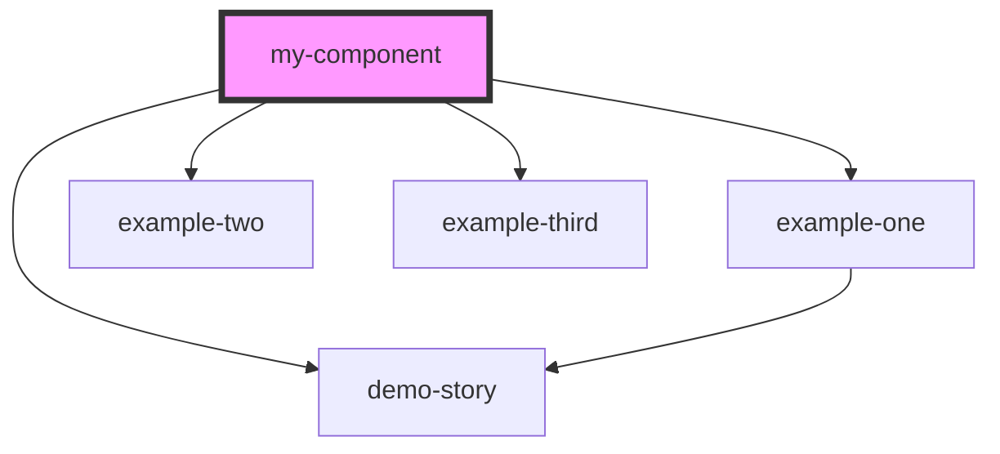

# my-component

<!-- Auto Generated Below -->

## Properties

| Property          | Attribute          | Description | Type     | Default     |
| ----------------- | ------------------ | ----------- | -------- | ----------- |
| `backgroundColor` | `background-color` |             | `string` | `'Red'`     |
| `first`           | `first`            |             | `string` | `undefined` |
| `last`            | `last`             |             | `string` | `undefined` |
| `middle`          | `middle`           |             | `string` | `undefined` |

## Dependencies

### Depends on

- [example-one](../example-one)
- [example-two](../example-two)
- [example-third](../example-third)
- [demo-story](../demo-story)

### Graph

----------------------------------------------

*Built with [StencilJS](https://stenciljs.com/)*
